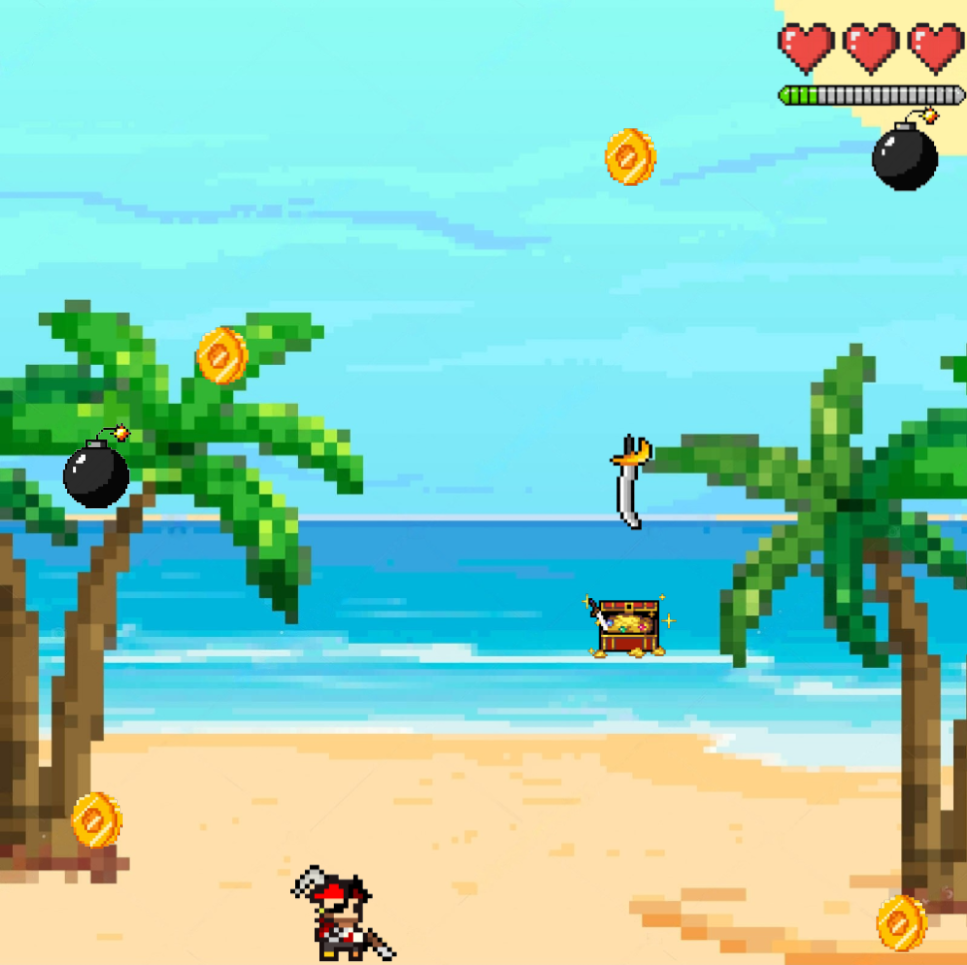
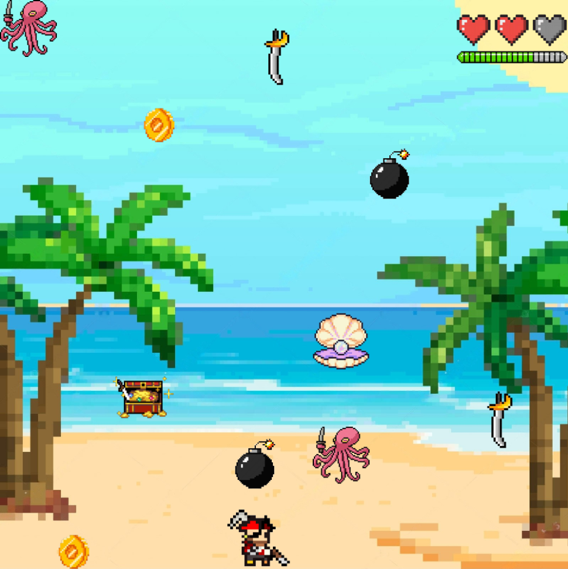
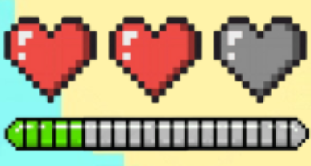
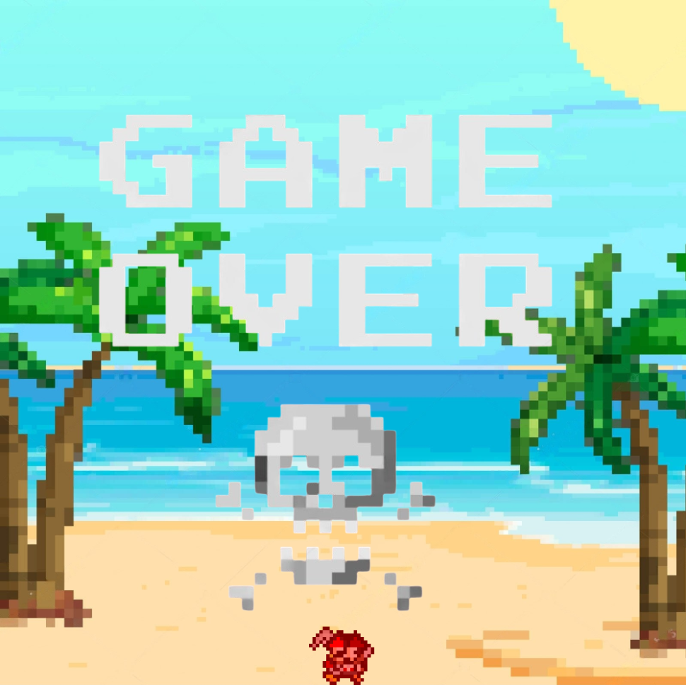

# Sky Treasures

## Equipo de desarrollo

- Franco Colombano
- Ramiro Casablancas
- Martina Movia
- Diego Schefer

## Capturas

### Nivel 1 en acción

### Nivel 2 en acción

### Indicadores de vidas y puntos

### Pantalla de victoria

### Pantalla derrota

## Reglas de Juego / Instrucciones

### Objetivo del juego
- Acumula puntos recolectando los objetos buenos (monedas, tesoros y perlas).
- Evita los objetos malos (bombas, espadas y pulpos).
- Completa el objetivo de puntos para avanzar de nivel.

### Cómo jugar
1. Usa las **flechas izquierda y derecha** para mover al pirata.
2. Agarra los siguientes objetos para ganar puntos:
   - **Monedas:** +5 puntos.
   - **Cofres:** +10 puntos.
   - **Perlas (Nivel 2):** +1 vida.
3. Evita los siguientes objetos:
   - **Bombas:** -1 vida.
   - **Espadas:** -10 puntos.
   - **Pulpos (Nivel 2):** -2 vidas.

### Niveles
#### Nivel 1
- **Objetivo:** Alcanzar **40 puntos** para pasar al siguiente nivel.
- Aparecen monedas, tesoros, bombas y espadas.

#### Nivel 2
- **Objetivo:** Alcanzar **100 puntos** para ganar el juego.
- Se agregan perlas (muy valiosas) y pulpos (enemigos más difíciles).

### Condicion para perder
- Perder todas las vidas.

## Otros

- Universidad Nacional de Hurlingham
- Versión de wollok
- Una vez terminado, no tenemos problemas en que el repositorio sea público 
